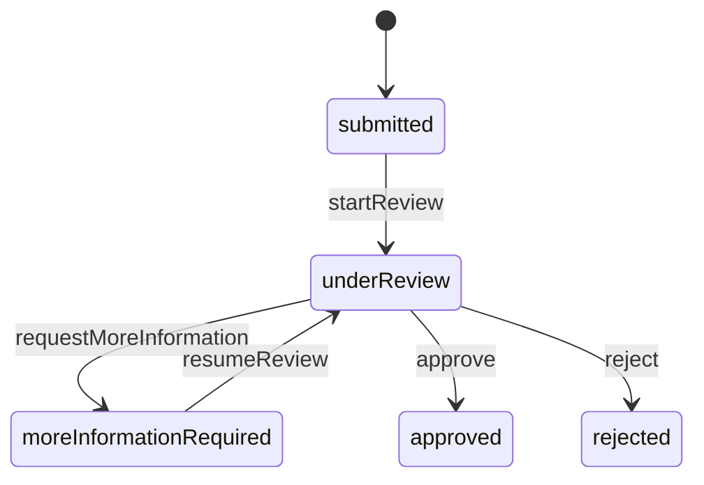

# simple claims service

this is a small java backend for claim intake and claim review. it covers one clear workflow from submission to approval or rejection. it also keeps an audit timeline, writes an outbox record for each accepted change, shows an officer queue, and reports open exposure by currency.

## what works

- submit motor and property claims
- assign one officer to a claim
- start and resume review
- request more information from the claimant
- record claimant information without hiding the officer handoff
- approve or reject with a reason
- read one claim with its ordered timeline
- filter the open work queue by status and officer
- report open exposure by market and currency
- reject stale concurrent updates
- return stable problem codes
- publish openapi at `/v3/api-docs`

## design

the project is one spring boot service with four simple boundaries:

```text
http api -> application commands and reads -> claim domain
                          |
                          v
             claims + timeline + outbox
```

the domain package has no spring, jpa, validation, or json annotations. the application layer owns use cases and transactions. the persistence layer maps domain snapshots to jpa. the api layer owns wire validation and lower camel case json values.

## claim states



claimant information is an audited event while the claim stays in `moreInformationRequired`. an officer must use `resumeReview` to take control again.

## rest and outbox

rest is used for commands that need an immediate answer. each accepted command saves the claim, one timeline row, and one outbox row in the same transaction. the outbox is the safe handoff point for a later kafka publisher. a live broker is not added because it would add setup without improving this assessment workflow.

## requirements

- java 21
- powershell on windows for the live check
- no system maven install; the wrapper is included

the local work used temurin 21 under ignored `.tools/`. reviewers can use any java 21 build.

## run

```powershell
.\mvnw.cmd spring-boot:run
```

the service starts on `http://localhost:8080`. local data is stored under ignored `data/`. health is at `http://localhost:8080/actuator/health`.

## test

```powershell
.\mvnw.cmd verify
```

`verify` runs the unit and integration tests, builds the jar, and checks java formatting.

run the dependency security gate with:

```powershell
.\mvnw.cmd org.owasp:dependency-check-maven:12.2.2:check "-DfailBuildOnCVSS=7"
```

the first run can take several minutes while it builds the local vulnerability database. the html report is written under ignored `target/`.

## demo

start with three fictional claims:

```powershell
.\mvnw.cmd spring-boot:run "-Dspring-boot.run.profiles=demo"
```

or run the full process check:

```powershell
powershell -NoProfile -ExecutionPolicy Bypass -File scripts\live-check.ps1
```

the script uses a free port and a database under the system temp folder. it checks health, demo data, submission, assignment, review, approval, timeline, exposure, and openapi. it stops the child process and removes only its own temp folder.

the request collection at `requests/claims.http` can also run the full workflow in an editor that supports http files.

## endpoints

| method | path | use |
| --- | --- | --- |
| `POST` | `/claims` | submit a claim |
| `GET` | `/claims/{claimId}` | get a claim and timeline |
| `POST` | `/claims/{claimId}/assignment` | assign an officer |
| `POST` | `/claims/{claimId}/actions` | change claim state |
| `POST` | `/claims/{claimId}/information` | add claimant information |
| `GET` | `/work-queue` | list open claims |
| `GET` | `/exposure?market=SG` | group open loss by currency |
| `GET` | `/actuator/health` | check service health |
| `GET` | `/v3/api-docs` | read openapi json |

queue filters are optional: `status=underReview` and `assigneeId=officer-7`. documented state and action values use lower camel case.

## errors

errors use standard problem details and add a stable `code` field:

```json
{
  "title": "claim change rejected",
  "status": 409,
  "detail": "the requested claim action is not allowed",
  "instance": "/claims/00000000-0000-0000-0000-000000000000/actions",
  "code": "claim_transition_invalid"
}
```

validation is `400`, missing claims are `404`, and state or stale-write conflicts are `409`. responses do not include stack traces or database messages.

## data and privacy

normal local runs use an h2 file database under `data/`. tests use an in-memory database. flyway owns the schema and hibernate validates it.

demo names and ids are fictional. no names, contact details, documents, credentials, or policy secrets are stored. claimant and officer ids are plain request fields for the assessment flow.

## sprint choices

- h2 keeps local review simple; production should use a managed relational database.
- claimant and officer ids show ownership rules but are not authentication. production needs identity, roles, and authorization.
- the outbox is durable evidence, but no live kafka publisher is included in this sprint.
- attachments, payments, fraud scoring, notifications, and policy lookup are outside this focused slice.

## next production work

- add oauth2 resource server security and role checks
- use postgres and integration tests with testcontainers
- publish pending outbox rows with retry and monitoring
- add pagination and indexed search for large queues
- add pii controls, retention rules, and audit access policy
- add metrics, tracing, alerts, and deployment files

## ai use

ai helped compare architecture options, turn the brief into a test-first plan, check framework versions, generate focused test ideas, and challenge edge cases such as stale writes, rollback, currency grouping, and money scale. every generated change was run locally and checked against focused and full tests. `docs/ai-journal.md` records the real prompts, decisions, failures, and checks.

## source map

- `claim/domain` has lifecycle rules
- `claim/application` has commands, reads, and ports
- `claim/persistence` has jpa mappings and adapters
- `claim/api` has json mapping and routes
- `shared/api` has problem details
- `bootstrap` has time and fictional demo data
- `db/migration` has the flyway schema
- `scripts/live-check.ps1` proves a real running process
